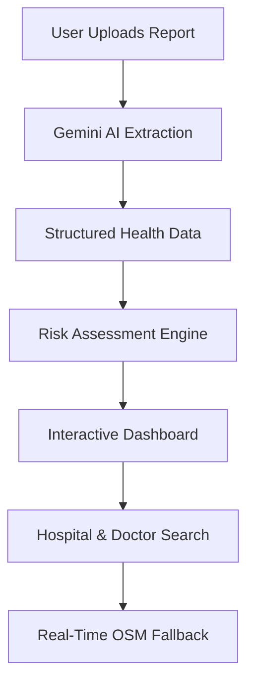

# MedIntel AI: Smart Health Report Analyzer & Risk Predictor

MedIntel AI is a cutting-edge patient-centric platform that leverages **Google Gemini AI** to transform complex medical reports into actionable health insights. It provides real-time risk assessments, intuitive data visualizations, and an intelligent healthcare discovery engine.

---

## 🚀 Key Features

### 📄 1. AI Report Extraction
Instantly parse PDF and image-based medical reports (CBC, Liver Function, etc.) to extract patient vitals and lab values with high accuracy. No manual entry required.

### 🩺 2. Health Risk Prediction
Dynamic AI assessment of potential health risks based on clinical data:
- **Cardiovascular Health**: Real-time evaluation of heart markers.
- **Diabetes Risk**: Continuous monitoring of glucose trends.
- **Organ Function**: Automated insights into Kidney and Liver health indicators.

### 🏥 3. Smart Consultant Discovery
A real-time engine to find **10+ top-rated hospitals** and specialized doctors (Cardiologists, Hematologists, etc.) in your specific city.
- Powered by a **Multi-Model Fallback System** (Gemini 2.0/Pro/OSM).
- Verified contact details and realistic consultation fee ranges.

### 📊 4. Interactive Health Dashboard
Modern, glassmorphism-inspired UI for tracking:
- **Health Trends**: Visual representation of "Risk Levels" (High, Moderate, Stable).
- **Lab Values**: Breakdown of Hemoglobin, WBC, Platelets, and more.

### 🎨 5. Premium UI/UX
- **Dual-Theme Engine**: Seamlessly switch between Premium Dark and Accessible Light modes.
- **Micro-Animations**: Smooth transitions using CSS3 and Lucide Icons.

---

## 🏗️ Project Architecture



---

## 🛠️ Tech Stack

- **Framework**: [React.js](https://reactjs.org/) (via Vite)
- **AI Model**: [Google Gemini Pro / Flash](https://ai.google.dev/)
- **Icons**: [Lucide React](https://lucide.dev/)
- **Styling**: Vanilla CSS (Custom Design System)
- **Maps/Discovery**: OpenStreetMap (Nominatim API)

---

## 📦 Installation & Setup

### Prerequisites
- Node.js (v18 or higher)
- A Google Gemini API Key ([Get one here](https://aistudio.google.com/))

### Steps
1. **Clone the repository**:
   ```bash
   git clone https://github.com/pshree2003/Smart-Health-Report-Analyzer-with-AI-Risk-Prediction.git
   cd Smart-Health-Report-Analyzer-with-AI-Risk-Prediction
   ```

2. **Install dependencies**:
   ```bash
   npm install
   ```

3. **Configure Environment Variables**:
   Create a `.env` file in the root directory and add:
   ```env
   VITE_GEMINI_API_KEY=your_api_key_here
   ```

4. **Run the application**:
   ```bash
   npm run dev
   ```

---

## 🛡️ License
Distributed under the MIT License. See `LICENSE` for more information.

## 👨‍💻 Developed by
[PShree](https://github.com/pshree2003) - *Building the future of AI-driven healthcare.*
