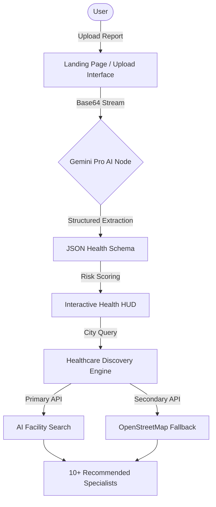

# MedIntel AI: Advanced Health Diagnostic & Risk Prediction Platform

**MedIntel AI** is a professional-grade health informatics platform designed to bridge the gap between complex laboratory data and actionable patient insights. By leveraging State-of-the-Art (SOTA) Large Language Models via the **Google Gemini Pro** infrastructure, MedIntel AI automates the extraction, analysis, and visualization of clinical reports to provide a comprehensive 360-degree view of a patient’s health trajectory.

---

## 🔬 About the Project

In the current healthcare landscape, patients often struggle with the interpretation of dense pathological reports, leading to delayed interventions or unnecessary anxiety. **MedIntel AI** address this by providing a unified, AI-driven diagnostic buffer. Our mission is to empower users with precise clinical context and streamlined specialist discovery, ensuring that predictive healthcare is accessible, intuitive, and data-driven.

---

## 🛡️ Core Capabilities

### 1. Intelligent Clinical Data Extraction
Utilizing high-performance Multimodal AI, the platform parses unstructured data from PDF and image-based laboratory results (e.g., Complete Blood Count, Metabolic Panels). It identifies critical markers with low-latency and maps them to a structured clinical schema.

### 2. Predictive Risk Stratification
The platform employs specialized AI agents to evaluate longitudinal and static health markers against clinical benchmarks to predict risks for:
- **Cardiovascular Resilience**: Assessment of lipid profiles and inflammatory markers.
- **Glycemic Stability**: Analysis of glucose and HbA1c indicators for Diabetological risk.
- **Hematological Balance**: Detection of anomalies in oxygen-carrying capacity and immune response.

### 3. Smart Healthcare Discovery Engine
A dual-layer routing system that matches identified health risks with appropriate medical facilities:
- **Prioritized Specialist Matching**: Based on report findings (e.g., Hematologists for low RBC).
- **Geospatial Discovery**: Real-time identification of 10+ top-tier hospitals within the user's vicinity.
- **Fail-Safe Logic**: Integrated OpenStreetMap (OSM) fallback ensuring continuous availability of healthcare data.

### 4. Professional Health Dashboard
A high-fidelity visualization layer designed for clinical clarity:
- **Risk Indicator Gauges**: Intuitive color-coded health status tracking.
- **Trend Analysis**: Quantitative breakdown of critical lab values.
- **Adaptive UI**: Optimized for both high-contrast professional environments and accessibility-focused light themes.

---

## 🏗️ Technical Architecture



---

## 🛠️ Technology Stack

| Layer | Technology |
| :--- | :--- |
| **Core Framework** | React.js (Vite Runtime) |
| **Artificial Intelligence** | Google Gemini 1.5 Flash / 2.0 Pro / 1.5 Pro |
| **Geospatial Data** | Nominatim (OpenStreetMap) |
| **State Orchestration** | React Context API |
| **Typography & UI** | Outfit (Headings), Inter (Body), Lucide React |

---

## ⚙️ Installation & Deployment

### Environment Prerequisites
- **Node.js**: Version 18.0.0 or higher.
- **API Access**: A valid Google AI Studio API Key.

### Initial Configuration
1. **Clone the Repository**:
   ```bash
   git clone https://github.com/pshree2003/Smart-Health-Report-Analyzer-with-AI-Risk-Prediction.git
   cd Smart-Health-Report-Analyzer-with-AI-Risk-Prediction
   ```

2. **Dependency Management**:
   ```bash
   npm install
   ```

3. **Infrastructural Constants**:
   Create a `.env` file in the root directory:
   ```env
   VITE_GEMINI_API_KEY=YOUR_SECURE_API_KEY
   ```

4. **Production Readiness**:
   ```bash
   npm run build
   # Deploy contents of the 'dist' folder to your preferred host (Vercel, Netlify, etc.)
   ```

---

## 🔐 Data Privacy & Ethical AI
MedIntel AI is built with **Privacy by Design**. 
- **Ephemeral Processing**: Health data is processed in-memory for the duration of the session and is not persisted on our servers.
- **Transparency**: AI-generated predictions are intended for **informational purposes only** and should be verified by a licensed medical professional.

---

## ⚖️ License
This project is licensed under the **MIT License**. See the [LICENSE](LICENSE) file for detailed legal terminology.

## 👥 Contributors
Developed and maintained by **[PShree](https://github.com/pshree2003)**. 
*Advancing the boundaries of AI-driven prophylactic medicine.*
