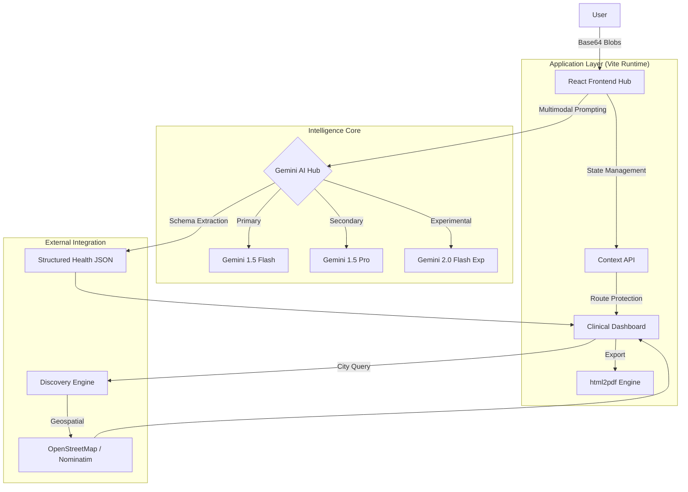
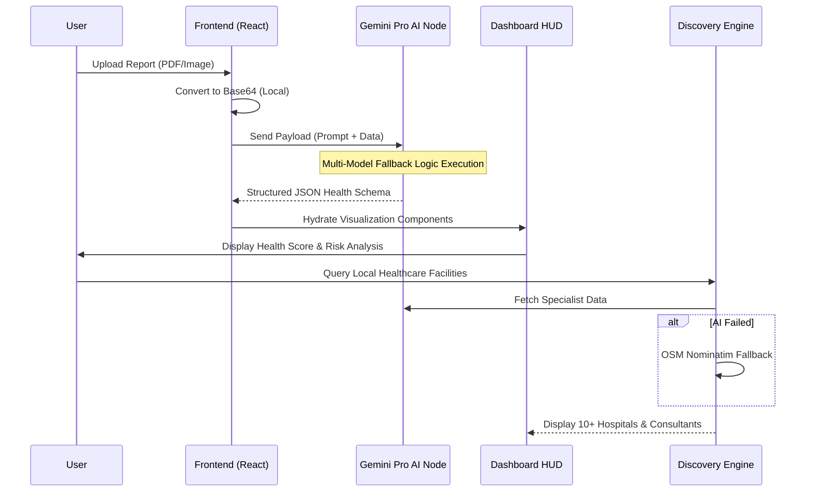

# 🛡️ MedIntel AI: Advanced Health Diagnostic & Risk Prediction Platform

[](https://opensource.org/licenses/MIT)
[](https://react.dev/)
[](https://vitejs.dev/)
[](https://ai.google.dev/)
[](https://github.com/pshree2003/Smart-Health-Report-Analyzer-with-AI-Risk-Prediction)
[](https://medintel-ai-shrikantp.surge.sh/)

**MedIntel AI** is a professional-grade health informatics ecosystem designed to bridge the gap between complex laboratory data and actionable patient insights. By leveraging State-of-the-Art (SOTA) Multimodal Large Language Models via the **Google Gemini Pro** infrastructure, MedIntel AI automates the extraction, analysis, and visualization of clinical reports to provide a 360-degree view of a patient’s health trajectory.

---

## 🏗️ Technical Architecture

The platform is designed around a decoupled, intelligence-first architecture that prioritizes privacy and low-latency processing.



---

## 🔄 Operational Workflow

MedIntel AI follows a strict linear pipeline from unstructured ingestion to structured medical discovery.



---

## 🔬 Core Capabilities

### 1. Intelligent Clinical Ingestion
Utilizing high-performance Multimodal AI, the platform parses unstructured data from PDF and image-based laboratory results (e.g., CBC, Metabolic Panels). It identifies critical markers with high precision and maps them to a validated clinical schema.

### 2. Predictive Risk Stratification
Specialized AI agents evaluate longitudinal and static health markers against clinical benchmarks to predict risks for:
*   **Cardiovascular Resilience**: Assessment of lipid profiles and inflammatory markers.
*   **Glycemic Stability**: Analysis of glucose and HbA1c indicators.
*   **Hematological Balance**: Detection of anomalies in immune response and oxygen-carrying capacity.

### 3. Smart Healthcare Discovery
A dual-layer routing system matches identified health risks with appropriate medical facilities:
*   **Specialist Matching**: Prioritizes Hematologists or Cardiologists based on report findings.
*   **Geospatial Discovery**: Real-time identification of top-tier hospitals within the user's vicinity.

---

## 🛠️ Technology Stack

| Component | Technology | Purpose |
| :--- | :--- | :--- |
| **Framework** | React 19 / Vite 8 | Core SPA infrastructure and fast HMR. |
| **Intelligence** | Google Gemini 1.5 | SOTA Multimodal extraction and reasoning. |
| **Geospatial** | OSN / Nominatim | Privacy-focused hospital location discovery. |
| **State** | React Context API | Global theme and health data orchestration. |
| **UI/UX** | CSS Glassmorphism | Premium, medical-grade visual interface. |
| **Icons** | Lucide React | High-contrast, accessibility-ready iconography. |

---

## ⚙️ Installation & Deployment

### Prerequisites
*   **Node.js**: v18.0.0+
*   **API Key**: A valid [Google AI Studio](https://aistudio.google.com/) Gemini API Key.

### Setup Guide
1.  **Clone the Ecosystem**:
    ```bash
    git clone https://github.com/pshree2003/Smart-Health-Report-Analyzer-with-AI-Risk-Prediction.git
    cd Smart-Health-Report-Analyzer-with-AI-Risk-Prediction
    ```
2.  **Initialize Environment**:
    Create a `.env` file in the root:
    ```env
    VITE_GEMINI_API_KEY=YOUR_SECURE_API_KEY
    ```
3.  **Install Dependencies**:
    ```bash
    npm install
    ```
4.  **Launch Local Instance**:
    ```bash
    npm run dev
    ```

---

## 🔐 Privacy & Ethical AI
**MedIntel AI** operates on the principle of **Ephemeral Health Data**. 
*   **Local Processing**: File-to-Base64 conversion happens entirely in the browser.
*   **Non-Persistence**: Health data is processed in-memory for the duration of the session and is **not persisted** on any external database.
*   **Medical Disclaimer**: AI-generated predictions are for informational purposes only and must be verified by a licensed medical professional.

---

## 👥 Contributors & Support
Developed and maintained by **[PShree](https://github.com/pshree2003)**. 
*Advancing the boundaries of AI-driven prophylactic medicine.*

---
© 2024 MedIntel AI Ecosystem. Licensed under MIT.
